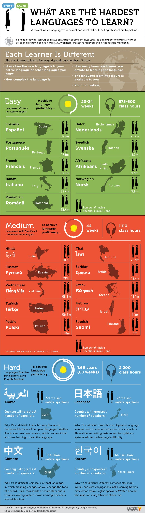
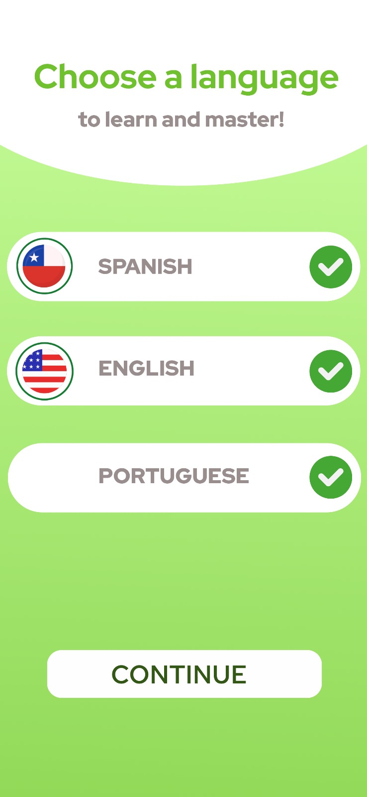

## Startup: _`Linguamaps`_

    

### Elevator Pitch

**Linguamaps** is a revolutionary web application that transforms the way we learn languages by using _AI_ to deliver a <u> personalized, immersive, and cost-effective learning experience</u>. By integrating real-world scenarios with interactive exercises on a _Google Maps_ Street View interface, **Linguamaps** offers users a practical approach to mastering new languages by taking advantage of the knowledge the user has of their native language.  Language learning is not <u>equal</u>. **Lingumaps** takes into account the advantages and disadvantages of the learner based on their background. It offers a realistic long term language `practice for anyone in any level`.

### Key Features

**`AI-Driven Language Learning`:** Personalized _learning experiences_ that adapt to the user's language level and progress. 
**`Real-World Practice`:** Engage with practical scenarios like ordering food, asking for directions, or conversing in daily situations. 
**`Progressive Learning Path`:** Start with simple phrases and gradually move to more complex sentence structures as proficiency improves. 
**`Minimalistic Progress Tracking`:** Receive constructive feedback and progress reports focused on mastering language skills without gamification distractions. 
**`Seamless Interface`:** Utilizes Google Maps Street View for an immersive learning environment, simulating real-life conversations without game-like elements. 

    ---------------------------------------------

### Technologies overview: _`Linguamaps`_

At this project, we will be utilizing the following technologies:  
| Feature | Description |
|--------------------------|--------------------------------------------------------------------------------------------------------------------|
| **HTML** | Uses correct HTML structure for the application, with pages for login, main interface, and progress tracking. |
| **CSS** | Styling for responsive design, good use of whitespace, and consistent color schemes across devices. |
| **JavaScript** | Handles user interactions, such as selecting languages, navigating through exercises, and rendering feedback. |
| **React** | Utilizes React for building a single-page application with component-based structure, routing, and state management.|
| **Service** | Backend service with endpoints for:  - `login`: Handles user authentication and session management.  - `retrieveExercises`: Fetches personalized language exercises.  - `submitProgress`: Submits user progress for tracking and feedback.|
| **Third-Party Service** | Integration with Google Maps API for Street View and OpenAI API for generating dialogue prompts. |
| **DB/Login** | Uses a secure database to store user profiles, progress data, and credentials. Ensures that users are authenticated before accessing learning features. |
| **WebSocket** | Enables real-time updates and interactions, such as immediate feedback on exercises and collaborative practice with other users. |

---

  

🌟 **`Linguamaps`** Design 🌟

Below are rough sketches of the application's layout: 

 ### **Main Interface Layout**:

    

### **Languages Choose Page**:

    

### Additional Features (Ideas)
#### Authentication
- **User Accounts:** Users can register, log in, and manage their profiles. Secure authentication will be implemented to ensure data privacy.
- **Display:** Upon login, the user's name will be displayed on the interface, along with personalized learning paths.

#### Database
- **Persistent Data Storage:** User progress, preferences, and account details will be stored in a secure database, ensuring data integrity and availability across sessions.
- **User Data:** Manage user-specific data such as progress reports and personalized learning content.

#### WebSocket
- **Real-Time Data Exchange:** WebSockets will enable real-time updates, such as live feedback on exercises and interactive elements between users (e.g., practicing dialogue with peers).
- **Use Cases:** Real-time notifications and updates on other users' progress in collaborative learning environments.
---

## Project Deliverables

1. **[HTML Deliverable](assets/Deliverables/HTML_Deliverable.md)**  
   Details the structure of the application using HTML, including pages, navigation, text, images, and real-time updates.
2. **[CSS Deliverable](assets/Deliverables/CSS_Deliverable.md)**  
   Describes the styling of the application, focusing on layout, navigation, responsiveness, and consistency.

3. **[React Deliverable](assets/Deliverables/React_Deliverable.md)**  
   Outlines the implementation of the application using React, including components, state management, routing, and dynamic updates.
4. **[Service Deliverable](assets/Deliverables/Service_Deliverable.md)**  
   Covers the backend service setup, including endpoints, third-party API integration, and frontend-backend communication.◊
